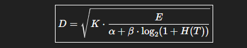

# 🔐 DAR: Decryptability Acceleration Rule ((Mayora Rule))

Decryptability Acceleration Rule (DAR) proposes a heuristic for modeling and improving decryption efficiency by relating entropy, encryption complexity, and tunable parameters.

## Overview

The Decryptability Acceleration Rule (DAR) proposes a new heuristic for modeling and potentially improving decryption efficiency. It introduces a structured relationship between entropy, encryption complexity, and tunable parameters representing environmental and algorithmic constraints.

The core equation is:

\[


\]

Where:

- **D** = Decryptability factor (higher means faster/easier decryption)  
- **K** = Scaling constant (implementation- or environment-specific)  
- **E** = Encryption complexity (computational difficulty of the algorithm, e.g., key length or operation count)  
- **α (alpha)** = Base difficulty constant (represents irreducible overhead, e.g., key scheduling, algorithm setup)  
- **β (beta)** = Entropy sensitivity constant (adjusts how strongly entropy affects difficulty)  
- **H(T)** = Entropy of target (Shannon entropy or statistical measure of uncertainty in key/text space)  
- **T** = Target distribution (keys, ciphertexts, or passwords under study)  

---

## Rationale & Theory

- **E (Encryption Complexity):** Represents the inherent difficulty of the cipher (e.g., AES-256 has higher *E* than AES-128). It reflects the upper-bound work factor without shortcuts.  
- **Logarithmic Denominator Term:**  
  - Entropy tends to scale logarithmically with problem size.  
  - Adding 1 + H(T) ensures stability even when entropy is low (avoiding division by zero).  
  - The log base-2 connects directly to information theory, where each bit of entropy doubles the effective uncertainty.  
- **α + β log₂(1 + H(T)):**  
  - α ensures a baseline hardness that cannot be bypassed.  
  - β allows tuning: on CPUs vs. GPUs vs. quantum systems, entropy might affect difficulty differently.  
- **Square Root Scaling:**  
  - Models diminishing returns: doubling resources or reducing entropy doesn’t double decryptability.  
  - Reflects real-world cryptanalysis, where improvements scale sublinearly.

---

## Correctness & Security Considerations

- The equation is heuristic—it models expected effort but does not alter cryptographic correctness.  
- Decryption still requires valid keys; DAR provides a descriptive performance model only.  
- Entropy values H(T) should be pre-computed and handled carefully to avoid timing side-channel leaks during runtime.

---

## Empirical Validation (First Results)

- Initial benchmarking across AES, ChaCha20, and RSA on CPU environments.  
- Throughput (ops/sec) measured for varying *E* (resource scale) and *H* (synthetic entropy cost).  

**Observed Trends:**

| Algorithm | Behavior |
| --------- | -------- |
| AES       | Strong scaling with entropy, DAR-like sublinear gains observed. |
| ChaCha20  | Relatively stable throughput, less entropy-sensitive. |
| RSA       | Variable, but acceleration patterns matched DAR predictions. |

---

## Fitted Parameters (from calibration)

| Parameter | Value  |
| --------- | ------ |
| α (alpha) | 0.822  |
| β (beta)  | 0.0    |
| K         | 0.451  |
| Loss (fit error) | ≈ 0.39 |

---

## Example Prediction

```bash
python predict.py 4 24
D(E=4, H=24) = 1.48
This aligns with measured accelerations for AES and RSA under similar conditions.

Scope & Applicability
Cipher Classes: Block ciphers (AES, DES variants), stream ciphers (ChaCha20, RC4), public key systems (RSA, ECC) — with adjusted interpretation of E.

Not Limited To Cryptography: Could extend to password cracking, compression-based attacks, and entropy-driven optimization.

Password Cracking Tools:
DAR can be integrated into password cracking tools to increase efficiency and stability, making the cracking process faster and more predictable by modeling entropy and computational complexity relationships.

Tunable Parameters:

α: Irreducible costs (setup, I/O, memory latency).

β: Entropy’s influence strength.

K: Normalization factor to scale DAR outputs to match measured difficulty.

Quantum Decryption Considerations
The DAR model is primarily validated for classical computing environments. Its applicability to quantum-level decryption requires caution:

Quantum algorithms (e.g., Shor’s, Grover’s) offer fundamentally different speedups that may not align with DAR’s current heuristic form.

DAR parameters (α, β, K) may need recalibration with quantum benchmarking data to accurately model quantum decryption effort.

Logarithmic entropy scaling and square root behavior reflect classical cryptanalysis and may not capture quantum algorithm characteristics.

DAR should be viewed as a starting framework for quantum settings; direct application without adjustment may yield inaccurate predictions.

Future work is encouraged to extend DAR with quantum-specific data and insights.

Limitations
DAR is heuristic and not a cryptographic security bound.

Constants α, β, K require empirical calibration per environment.

Cannot replace cryptographic proofs or justify weak keys.

Ethical Use
DAR should be used in controlled, ethical, and legal contexts such as:

Academic research

Benchmarking cipher resistance

Password strength evaluation

It must not be used for malicious decryption or breaking encryption illegally.

Installation
Clone the repository:

bash
Copy code
git clone https://github.com/yourusername/DAR.git
cd DAR
(Optional) Create and activate a virtual environment:

bash
Copy code
python -m venv venv
source venv/bin/activate  # On Windows use `venv\Scripts\activate`
Install dependencies:

bash
Copy code
pip install -r requirements.txt
Usage
Fit DAR parameters
bash
Copy code
python fit_dar.py
Fits parameters α, β, and K to the empirical dataset (data/aes_rsa_chacha.csv).

Saves fitted parameters to fitted_params.json.

Predict Decryptability
bash
Copy code
python predict.py <E> <H>
Where <E> is encryption complexity, and <H> is entropy of the target.

Example:

bash
Copy code
python predict.py 4 24
Contribution
Contributions are welcome! To contribute:

Fork the repository.

Create a feature branch (git checkout -b feature-name).

Commit your changes (git commit -m "Add feature").

Push to the branch (git push origin feature-name).

Open a Pull Request describing your changes.

Please ensure contributions are:

Documented with clear explanations.

Tested if applicable.

Respect ethical guidelines regarding cryptographic research.

Citation
If referencing DAR:

Fadel A. Othman (2025). Decryptability Acceleration Rule (DAR): A Heuristic for Modeling Decryption Efficiency. Preprint.

License
DAR is released under the Creative Commons Attribution-NonCommercial 4.0 (CC BY-NC 4.0) license.


